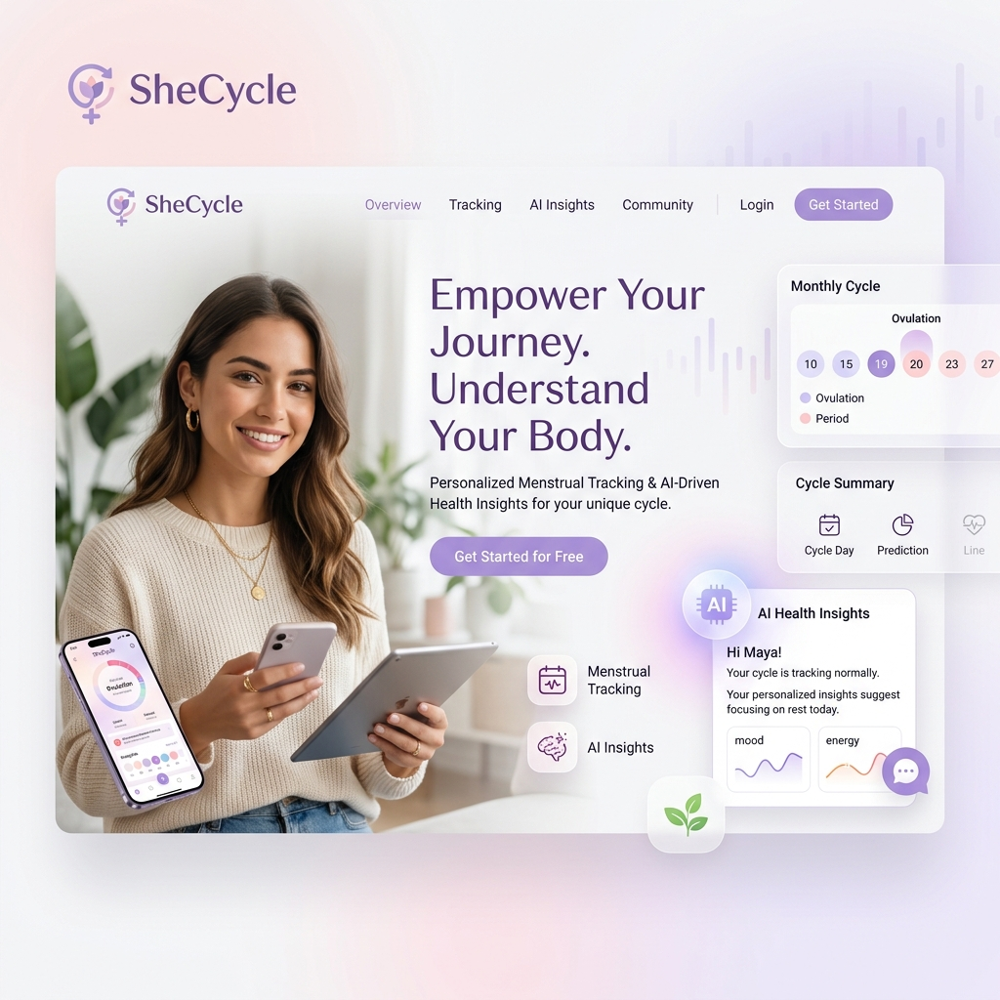
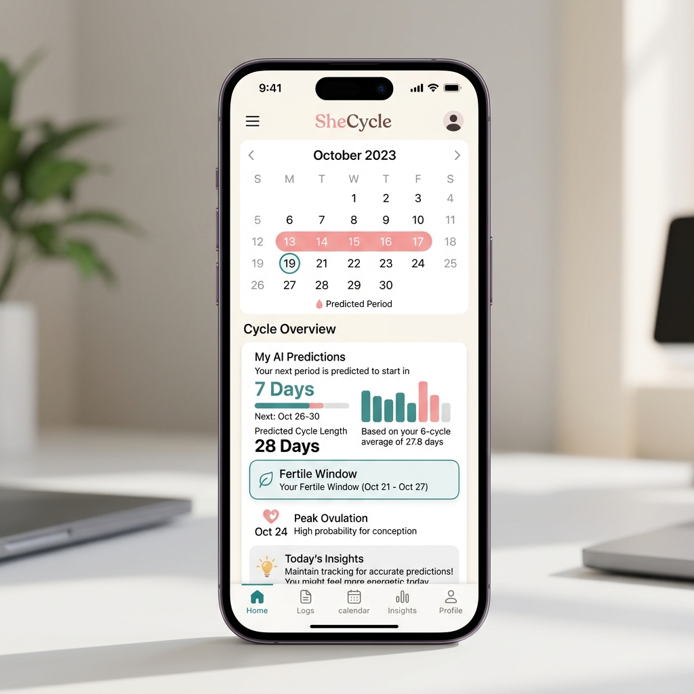

# SheCycle | AI-Powered Women's Health Platform

**SheCycle** is a complete menstrual health and fertility platform designed with cutting-edge **AI technology**. It empowers women with personalized, accurate predictions for their cycles, fertile windows, and overall reproductive wellness.

---

## ✨ Features
- **🔮 AI-Powered Prediction**: Uses a **Random Forest Machine Learning** model to predict next period dates based on age, BMI, stress levels, and sleep.
- **📅 Interactive Cycle Dashboard**: Beautifully designed UI to track your follicular, menstrual, ovulation, and luteal phases.
- **💡 Personalized Health Recommendations**: AI-driven lifestyle insights to help manage stress and improve cycle regularity.
- **📚 Integrated Health Library**: Expert-backed resources on mental wellness, fertility, and hygiene.
- **📱 Fully Responsive**: Modern, glassmorphism-inspired design that works on mobile and desktop.

---

## 🎨 Professional Dashboard

*A preview of the SheCycle AI analysis results.*

---

## 🛠️ Tech Stack
This project showcases a sophisticated integration of modern web technologies:
- **Frontend Core**: React 19 + Material UI (MUI)
- **Styling**: Vanilla CSS for custom aesthetics + Google Fonts (Outfit & Playfair Display)
- **Backend**: Python 3.14 + Flask (High-Performance REST API)
- **Machine Learning**: Scikit-Learn (Random Forest Regressor & Classifier)
- **Data Engineering**: Pandas & NumPy for health metric processing
- **Build Tools**: Vite for lightning-fast frontend delivery

---

## 🚀 Getting Started

### Prerequisites
- [Node.js](https://nodejs.org/) (v18+)
- [Python](https://www.python.org/) (v3.10+)

### Backend Setup (The Brain)
1. `cd backend`
2. `pip install -r requirements.txt`
3. `python train_model.py` (Required to initialize AI models)
4. `python app.py` (Runs on port 8000)

### Frontend Setup (The Face)
1. In the root directory: `npm install`
2. `npm run dev` (Runs on port 5173)

---

## 📂 Project Structure
- **/backend**: Flask API, AI training scripts, and ML models.
- **/src**: React source code, components, and health calculators.
- **/public**: Static assets and images.
- **/screenshots**: Visual documentation of the platform.

---

## 🌟 Developer Note
Developed for **Bhawika-343** to demonstrate the powerful synergy between modern UI/UX design and sophisticated AI backends in the healthcare technology space.

© 2026 SheCycle Platform
